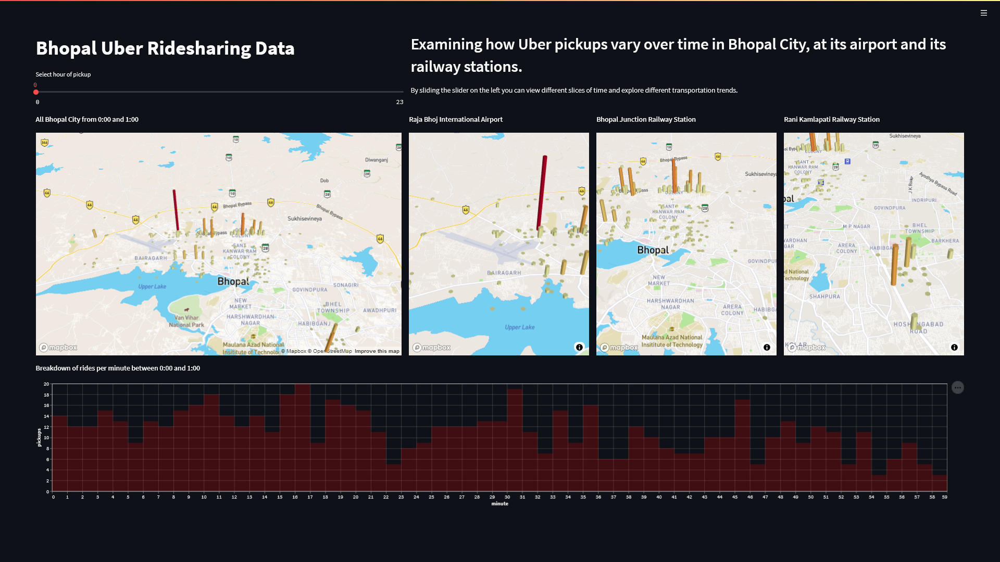

# Visualization of Uber Pickup Data in Bhopal, Madhya Pradesh
Sometimes it’s easy to give up on someone else’s driving. This is less stress, more mental space and one uses that time to do other things. Yes, that’s one of the ideas that grew and later became the idea behind Uber. With its 93 million monthly active users and _3.9 million_ active drivers, Uber completes _18.7 million rides_ each day globally. If seen the right way, this is a large amount of data which could be processed to extract some really useful information.

Just with the data in hand, one can easily resolve problems like peak traffic time and heavy traffic areas around oneself. This could not only help with the Road Traffic Control but also help the people to choose which route to take or which hour they should head out as per their convenience. Using the data, we can visualize and find patterns which can be helpful for providing real-time information as well as making some predictions.  

Visualizing the Uber data can be greatly helpful for both the users and company itself. The project focuses on answering questions such as which hour of the day is most busy or which place has the least pickups or any possible information that could be extracted from the pick-up and drop-off data.

Talking about our Uber data analysis project, data storytelling is an important component of machine learning through which companies are able to understand the background of various operations. With the help of visualization, companies can avail the benefit of understanding the complex data and gain insights that would help them to craft decisions. We applied the same for the Uber pickup data, for a city in India. Taking the reference of an already available Uber pickup dataset, we created one for the city of Bhopal and implemented the data visualization techniques to find some patterns that could help in any way possible.

----
## Working
Our work is to first analyse the number of uber pickups in a month and its density and then visualize it using [_streamlit_](https://streamlit.io/), [_pydeck_](https://pydeck.gl/) and [_altair_](https://altair-viz.github.io/).  
Our main goal is to analyse the busiest routes at different time of the day and the variation in the number of pickups at certain important landmarks such as __Raja Bhoj Airport__, __Rani Kamlapati Railway Station__ and __Bhopal Junction Railway Station__. 

----
## Output

After creating the dataset for Indian city and using data analytics and visualization methods to extract some useful information from that raw data, we can conclude that the real-life implementation of the same could help making Uber cabs more accessible to the customer.

----
## Bibliography
We were able to successfully complete the project because of the guidance provided by Dr. Rakesh R.
